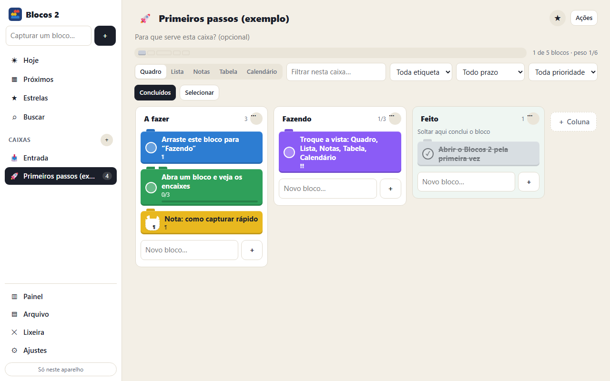

# Blocos 2

[](https://joaogabrielmontinirossi-sys.github.io/blocos2/)

Tarefas, notas e quadros como peças de montar, para Windows, site e celular. No [Blocos](https://github.com/joaogabrielmontinirossi-sys/blocos) o bloco é uma unidade de tempo; aqui o bloco é uma unidade de organização: uma tarefa ou uma nota que mora numa caixa, tem cor, peso e pode ter outros blocos encaixados dentro.

## Baixar (Windows)

Pegue o `Blocos2.exe` na página de [Releases](../../releases/latest) e abra. Não precisa instalar nada: o programa usa o Edge (ou o Chrome) que já está no Windows para mostrar a janela.

Como o arquivo não é assinado, o Windows pode mostrar o aviso do SmartScreen na primeira vez: clique em **Mais informações** e depois em **Executar assim mesmo**.

## No site e no celular

Abra **https://joaogabrielmontinirossi-sys.github.io/blocos2/** em qualquer navegador.

- **Android (Chrome)**: ⋮ › *Adicionar à tela inicial*.
- **iPhone/iPad (Safari)**: **Compartilhar** › **Adicionar à Tela de Início**.

Depois de aberta uma vez, a versão web funciona sem internet.

## Como funciona

| No app | É | Parecido com |
| --- | --- | --- |
| **Caixa** | Um espaço que guarda blocos | Quadro do Trello, lista do Google Tarefas, caderno do Evernote |
| **Bloco** | Uma tarefa ou uma nota | Cartão, tarefa, nota |
| **Encaixe** | Blocos dentro de blocos | Subtarefas, checklist, blocos do Notion |
| **Coluna** | Uma etapa dentro da caixa | Lista do Trello |
| **Etiqueta** | A cor da peça | Etiqueta, tag |
| **Peso** | Quantos pinos a peça tem (1 a 3) | Esforço, pontos |

Cada caixa pode ser vista de cinco jeitos, e lembra o último:

- **Quadro**: colunas com blocos para arrastar. Uma coluna pode ser a de conclusão (soltar ali conclui) e ter limite de blocos.
- **Lista**: tarefas com círculo de concluir e blocos de dentro que abrem na própria lista.
- **Notas**: grade de cartões com a prévia do texto.
- **Tabela**: uma linha por bloco, com coluna, etiqueta, prazo, prioridade e peso editáveis e ordenáveis.
- **Calendário**: o mês, com blocos para arrastar entre os dias.

Fora das caixas há **Hoje** (o que vence hoje e o que você pôs no dia), **Próximos**, **Estrelas**, **Buscar**, **Painel**, **Arquivo** e **Lixeira**.

### Captura rápida

Escreva uma linha em qualquer campo de captura:

```
Pagar boleto sexta às 14h #urgente @casa !! *
```

`sexta` vira o prazo, `às 14h` a hora, `#urgente` a etiqueta, `@casa` a caixa, `!!` a prioridade e `*` a estrela. Várias linhas coladas viram vários blocos.

A lista completa está em [FUNCIONALIDADES.md](FUNCIONALIDADES.md).

## Sincronização

Funciona como no [Blocos](https://github.com/joaogabrielmontinirossi-sys/blocos) e na [Frondosa](https://github.com/joaogabrielmontinirossi-sys/frondosa):

1. **Pasta do Google Drive para computador** (só no `.exe`): grava `blocos2-sync.json` em `Meu Drive\Blocos2` a cada alteração. Se o Google Drive para computador estiver instalado, já começa ligada; em **Ajustes** dá para desativar, trocar de conta ou escolher outra pasta.
2. **Conta Google** (`.exe`, site e celular): o mesmo arquivo fica na área privada do aplicativo no seu Google Drive. Usa o mesmo "ID do cliente OAuth" dos outros aplicativos; para o `.exe`, acrescente a origem `http://localhost:47894`.

Alterações feitas em dois aparelhos são mescladas por registro: vale a versão mais recente de cada caixa, coluna, bloco, etiqueta ou modelo, e as exclusões também são propagadas.

## Compilar

Só precisa do Windows (usa o compilador C# do .NET Framework, que já vem instalado):

```powershell
powershell -ExecutionPolicy Bypass -File .\build.ps1
```

| Pasta | Conteúdo |
| --- | --- |
| `app/` | O aplicativo (HTML, CSS e JavaScript puros, sem dependências) |
| `desktop/Blocos2.cs` | Programa de Windows: serve o app em `localhost` e grava a pasta de sincronização |
| `build.ps1` | Desenha os ícones e compila o `.exe` |
| `.github/workflows/` | Publica o site no GitHub Pages e o `.exe` em Releases a cada envio para a `main` |

## Licença

[MIT](LICENSE): pode usar, copiar, modificar e distribuir livremente, mantendo o aviso de autoria.
